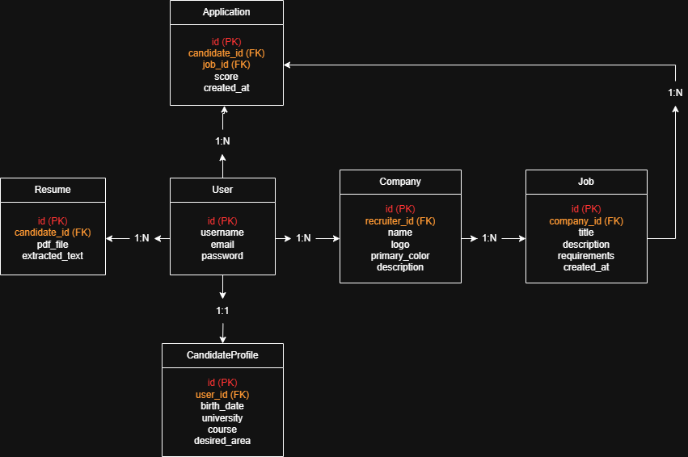

# 🚀 HireFlow

## 📌 Sobre o Projeto

O **HireFlow** é uma plataforma web de recrutamento e gerenciamento de processos seletivos desenvolvida para a disciplina de **Programação Web (GAC116)** da Universidade Federal de Lavras (UFLA).

O objetivo do sistema é simplificar o processo de recrutamento, permitindo que empresas publiquem vagas e candidatos realizem candidaturas através de uma plataforma centralizada.

Além do contexto acadêmico, o projeto foi idealizado com foco em uma possível evolução para um produto SaaS voltado para pequenas e médias empresas.

---

# ✨ Funcionalidades Implementadas

## 👨‍💼 Recrutadores

* Cadastro e gerenciamento de empresas.
* Cadastro de vagas.
* Gerenciamento de candidatos.
* Visualização de candidaturas.
* Dashboard administrativo via Django Admin.
* Interface administrativa customizada utilizando Jazzmin.

---

## 👨‍🎓 Candidatos

* Cadastro de perfil.
* Cadastro de currículo.
* Aplicação em vagas.
* Visualização das candidaturas realizadas.

---

## 🔗 API REST

A aplicação possui APIs desenvolvidas com Django REST Framework para comunicação entre frontend e backend.

### Endpoints implementados

* Empresas
* Vagas
* Currículos
* Candidaturas
* Perfis de candidatos

---

## 🎨 Frontend

Interface desenvolvida utilizando:

* Next.js
* React
* TypeScript
* Tailwind CSS

Funcionalidades disponíveis:

* Visualização de vagas
* Cadastro de candidatos
* Formulários de candidatura
* Consumo das APIs do backend

---

# 🏗️ Arquitetura do Sistema

```text
Frontend (Next.js)
        ↓
API REST (Django REST Framework)
        ↓
PostgreSQL
```

Toda a aplicação é executada utilizando containers Docker.

---

# 🗄️ Modelagem do Banco de Dados

O sistema utiliza PostgreSQL como banco de dados relacional.

## Principais Entidades

### User

Representa usuários autenticados do sistema.

### CandidateProfile

Informações complementares dos candidatos.

### Company

Empresas cadastradas na plataforma.

### Job

Vagas publicadas pelas empresas.

### Resume

Currículos enviados pelos candidatos.

### Application

Relacionamento entre candidato e vaga.

---

# 🗺️ Diagrama ER

Adicionar a imagem do diagrama ER do projeto:

```markdown

```

---

# ⚙️ Ambiente Administrativo

O sistema utiliza Django Admin customizado com o tema **Jazzmin**.

Funcionalidades implementadas:

## 🔍 Search Fields

Permite realizar buscas diretamente no painel administrativo.

```python
search_fields = ('title', 'requirements')
```

---

## 📋 List Display

Define quais colunas são exibidas na listagem.

```python
list_display = ('id', 'title', 'company', 'created_at')
```

---

## 🎛️ List Filter

Permite filtrar registros através da interface administrativa.

```python
list_filter = ('company', 'created_at')
```

---

## 🔥 Inline Editing

Permite editar entidades relacionadas diretamente dentro da entidade principal.

Exemplo:

* Company → Jobs

---

## 🧠 Clean Validation

Validações customizadas implementadas nos modelos.

Exemplo:

```python
def clean(self):
    if self.score < 0 or self.score > 100:
        raise ValidationError(
            "Score must be between 0 and 100."
        )
```

---

# 🛠️ Tecnologias Utilizadas

## Frontend

* Next.js
* React
* TypeScript
* Tailwind CSS

---

## Backend

* Django
* Django REST Framework
* Django Jazzmin

---

## Banco de Dados

* PostgreSQL

---

## DevOps

* Docker
* Docker Compose
* WSL2

---

# 📂 Estrutura do Projeto

```text
hireflow/
│
├── backend/
│   ├── accounts/
│   ├── jobs/
│   ├── applications/
│   ├── config/
│   ├── Dockerfile
│   ├── requirements.txt
│   └── data.json
│
├── frontend/
│   ├── app/
│   ├── components/
│   ├── services/
│   ├── public/
│   └── Dockerfile
│
├── docs/
│   └── diagrama-er.png
│
├── docker-compose.yml
│
└── README.md
```

---

# 🐳 Como Executar o Projeto

## Pré-requisitos

* Docker Desktop
* WSL2
* Git (opcional)

---

## Subir os Containers

Na raiz do projeto:

```bash
docker compose up --build
```

---

## Executar Migrations

Abra outro terminal:

```bash
docker exec -it hireflow_backend bash
```

Depois:

```bash
python manage.py migrate
```

---

## Restaurar Dados de Exemplo

```bash
python manage.py loaddata data.json
```

---

## Criar Superusuário

```bash
python manage.py createsuperuser
```

---

# 🌐 Acessos

## Frontend

```text
http://localhost:3000
```

---

## Backend

```text
http://localhost:8000
```

---

## Django Admin

```text
http://localhost:8000/admin
```

---

# 📸 Telas do Sistema

Adicionar screenshots do sistema:

```markdown


```

---

# 🚧 Próximos Passos

As próximas evoluções planejadas para o projeto incluem:

* Melhorar o algoritmo de matching entre currículo e vaga.
* Implementar análise semântica de currículos.
* Aprimorar o score de compatibilidade.
* Adicionar autenticação JWT completa.
* Implementar dashboards para recrutadores.
* Melhorar a experiência do usuário no frontend.
* Evoluir o sistema para arquitetura SaaS multiempresa.

---

# 👥 Equipe

* Samuel Vanoni
* João
* Daniel
* Lara

Universidade Federal de Lavras (UFLA)

Disciplina: Programação Web (GAC116)

Professor: Raphael

---

# 📄 Licença

Projeto desenvolvido para fins acadêmicos na disciplina de Programação Web da UFLA.

O código pode ser utilizado para estudos, pesquisas e evolução futura da plataforma.
